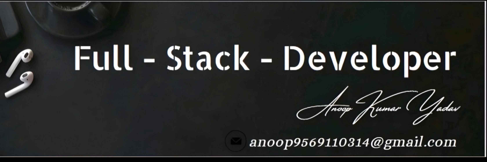

<!--h1 align="center" style="color: #4A90E2;">🌟 Anoop Kumar Yadav 🌟</h1>

    Transforming innovative tech visions into reality, one pixel at a time, as a full-stack developer aspirant.

-->
---

# 💫 About Me:
🔭 I’m currently working on:  
Transforming innovative tech visions into reality, one pixel at a time, as a full-stack developer aspirant.

👯 I’m looking to collaborate on:  
Projects that involve both front-end design and back-end architecture, where I can apply my skills as a coder and caffeine enthusiast.

🤝 I’m looking for help with:  
Tackling complex challenges in full-stack development that others might find daunting.

🌱 I’m currently learning:  
Advanced techniques in full-stack development to improve my expertise in front-end design and back-end solutions.

💬 Ask me about:  
Designing captivating user interfaces and developing robust server-side solutions.

⚡ Fun fact:  
I am a skilled coder with a deep passion for both front-end and back-end development, and I love overcoming challenging tech problems.

## 🌐 Socials:
   

## 💻 Tech Stack:
 
 
 
 
 
 
 
 
 
 

## 📊 GitHub Stats:
  
  

## 🏆 GitHub Trophies:

### ✍️ Random Dev Quote:

### 🔝 Top Contributed Repo:

---

<!-- Created with love and care by Anoop Kumar Yadav -->
