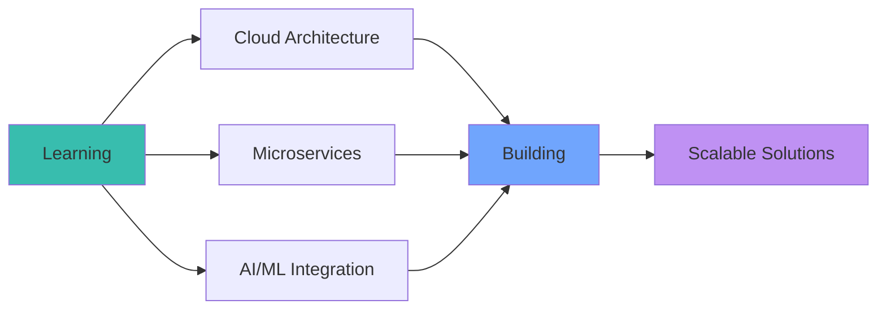

<div align="center">

<!-- Dynamic Header with Wave Effect -->


<!-- Snake Animation -->
<picture>
  <source media="(prefers-color-scheme: dark)" srcset="https://raw.githubusercontent.com/Platane/snk/output/github-contribution-grid-snake-dark.svg">
  <source media="(prefers-color-scheme: light)" srcset="https://raw.githubusercontent.com/Platane/snk/output/github-contribution-grid-snake.svg">
  
</picture>

<!-- Animated Typing Effect -->
<p align="center">
  
</p>

<!-- Status Badges -->
<p align="center">
  
  
  
  
  
</p>

</div>

<br/>

<!-- Divider -->


<br/>

##  **About Me**


```typescript
const anoop = {
  name: "Anoop Kumar Yadav",
  title: "Full-Stack Developer",
  location: "Varanasi, India",
  
  code: ["JavaScript", "TypeScript", "Python"],
  technologies: {
    frontend: ["React", "Next.js", "Tailwind CSS", "HTML5", "CSS3"],
    backend: ["Node.js", "Django", "Flask", "Express.js"],
    databases: ["MongoDB", "PostgreSQL", "MySQL", "SQLite"],
    devOps: ["Docker", "Git", "Linux"],
    tools: ["VS Code", "Postman"]
  },
  
  currentFocus: "Building production-grade web applications",
  learningGoals: ["Cloud Architecture", "Microservices", "AI/ML Integration"],
  
  philosophy: "Clean code, scalable architecture, exceptional UX"
};
```

<br/>

🔭 Currently working on **full-stack web applications** with modern tech stacks  
🌱 Exploring **cloud technologies** and **system design patterns**  
💡 Passionate about **problem-solving** and **building impactful products**  
🎯 Open to **collaborations** on innovative projects  
📫 Reach me at **anoop9569110314@gmail.com**

<br clear="right"/>

<!-- Divider -->


<br/>

##  **Tech Stack & Skills**

<div align="center">

### **Core Languages**

<p>
  
</p>

### **Frontend Development**

<p>
  
</p>

### **Backend Development**

<p>
  
</p>

### **Databases**

<p>
  
</p>

### **DevOps & Tools**

<p>
  
</p>

</div>

<br/>

<!-- Interactive Skill Progress -->
<details>
<summary><b>📊 Detailed Skill Proficiency</b></summary>
<br/>

| Technology | Proficiency | Experience | Projects |
|:-----------|:------------|:-----------|:---------|
| **JavaScript** |  | 2.5+ years | 25+ |
| **Python** |  | 2+ years | 20+ |
| **React.js** |  | 2+ years | 15+ |
| **Node.js** |  | 1.5+ years | 12+ |
| **Django** |  | 1.5+ years | 10+ |
| **MongoDB** |  | 2+ years | 18+ |
| **PostgreSQL** |  | 1+ year | 8+ |
| **Docker** |  | 1+ year | 6+ |
| **Git/GitHub** |  | 3+ years | 40+ |

</details>

<!-- Divider -->


<br/>

##  **Featured Projects**

<div align="center">

<table>
<tr>
<td width="50%" valign="top">

### **🎨 CodeHUB Text Editor**

<a href="https://github.com/Anoop-Kumar-Yadav/CodeHUB--TextEditor">
  
</a>

**Advanced IDE built with Python & Tkinter**

```bash
# Key Features
✓ Intelligent syntax highlighting
✓ Multi-tab file management
✓ Code auto-completion
✓ Dark/Light theme support
✓ Customizable interface
```

**Tech Stack:**  


<a href="https://github.com/Anoop-Kumar-Yadav/CodeHUB--TextEditor">
  
</a>

</td>
<td width="50%" valign="top">

### **✨ Syntax Frame**

<a href="https://github.com/Anoop-Kumar-Yadav/syntax-frame">
  
</a>

**Language-aware snippet toolkit for VS Code**

```bash
# Highlights
✓ Multi-language syntax support
✓ Intelligent code snippets
✓ Structure-focused templates
✓ Documentation integration
✓ Production-ready patterns
```

**Tech Stack:**  


<a href="https://github.com/Anoop-Kumar-Yadav/syntax-frame">
  
</a>

</td>
</tr>
</table>

<a href="https://github.com/Anoop-Kumar-Yadav?tab=repositories">
  
</a>

</div>

<!-- Divider -->


<br/>

##  **GitHub Analytics**

<div align="center">

<!-- Primary Stats Row -->
<p align="center">
  <a href="https://github.com/Anoop-Kumar-Yadav">
    
  </a>
  <a href="https://github.com/Anoop-Kumar-Yadav">
    
  </a>
</p>

<!-- Streak Stats -->
<p align="center">
  <a href="https://github.com/Anoop-Kumar-Yadav">
    
  </a>
</p>

<!-- Contribution Graph -->
<p align="center">
  <a href="https://github.com/Anoop-Kumar-Yadav">
    
  </a>
</p>

<!-- Trophy Display -->
<p align="center">
  <a href="https://github.com/Anoop-Kumar-Yadav">
    
  </a>
</p>

<!-- Language & Commit Stats -->
<p align="center">
  <a href="https://github.com/Anoop-Kumar-Yadav">
    
  </a>
  <a href="https://github.com/Anoop-Kumar-Yadav">
    
  </a>
</p>

<!-- Profile Summary -->
<p align="center">
  <a href="https://github.com/Anoop-Kumar-Yadav">
    
  </a>
</p>

</div>

<!-- Divider -->


<br/>

##  **Connect With Me**

<div align="center">

<p>
  <a href="https://www.linkedin.com/in/anoop-kumar-yadav-9b31b3283">
    
  </a>
  <a href="https://youtube.com/@ByteBrilliancez">
    
  </a>
  <a href="https://x.com/AnoopKumar75357">
    
  </a>
  <a href="https://wa.me/918795082897">
    
  </a>
  <a href="mailto:anoop9569110314@gmail.com">
    
  </a>
</p>

**💬 Let's collaborate on something extraordinary!**

</div>

<!-- Divider -->


<br/>

## 💡 **Development Philosophy**

<div align="center">

```python
class DeveloperMindset:
    """My approach to software development"""
    
    def __init__(self):
        self.principles = {
            "code_quality": "Clean, maintainable, and well-documented",
            "architecture": "Scalable, modular, and future-proof",
            "user_experience": "Intuitive, accessible, and delightful",
            "continuous_learning": "Always exploring new technologies",
            "collaboration": "Open-source advocate and team player"
        }
    
    def build_solution(self, problem):
        return self.analyze(problem) \
            .design() \
            .implement() \
            .test() \
            .deploy() \
            .iterate()

developer = DeveloperMindset()
print("Building the future, one line of code at a time ✨")
```

### **Core Values**

🎯 **Quality over Quantity** • 🚀 **Innovation over Convention** • 🤝 **Collaboration over Competition**

</div>

<!-- Divider -->


<br/>

## 📚 **Latest Blog Posts**

<!-- BLOG-POST-LIST:START -->
- 🚀 Building Scalable Web Applications with React and Node.js
- 💡 Understanding Design Patterns in Modern JavaScript
- 🔒 Best Practices for API Security
- 🎨 Creating Stunning UIs with Tailwind CSS
- ⚡ Performance Optimization Techniques for Web Apps
<!-- BLOG-POST-LIST:END -->

<!-- Divider -->


<br/>

## 🎯 **Current Focus**

<div align="center">



</div>

<!-- Divider -->


<div align="center">

## 🤝 **Let's Build Something Amazing Together**


I'm always excited to collaborate on innovative projects and explore new technologies.  
Whether you want to discuss ideas, build something together, or just chat about tech—feel free to reach out!

### ⭐ **If you find my work valuable, consider starring my repositories!**

---


<sub>**Crafted with 💙 by Anoop Kumar Yadav**</sub>

*"Code is like humor. When you have to explain it, it's bad."* – **Let's write self-explanatory code together!** 🚀

**Last Updated:** January 2026

</div>
